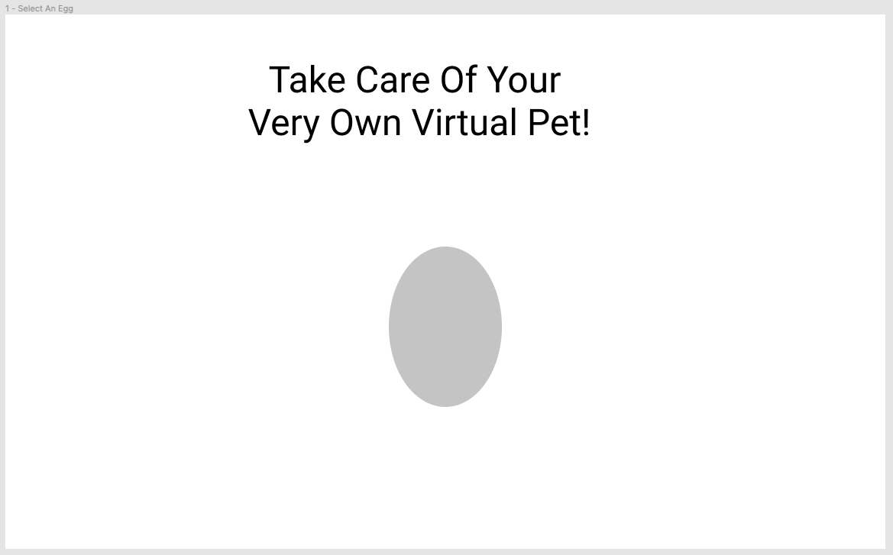
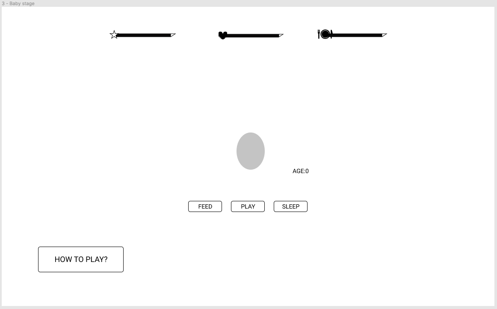
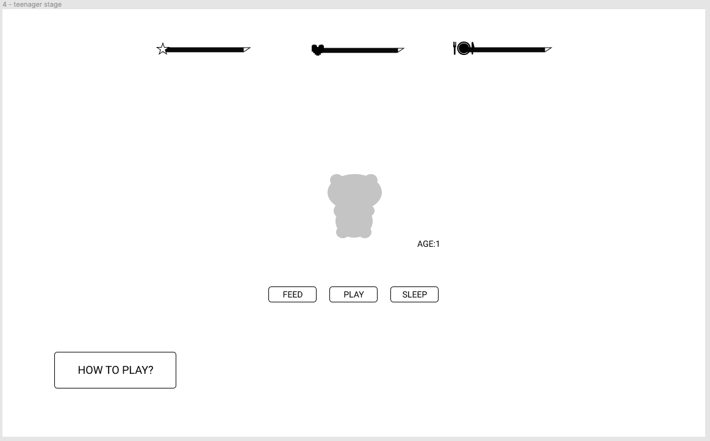
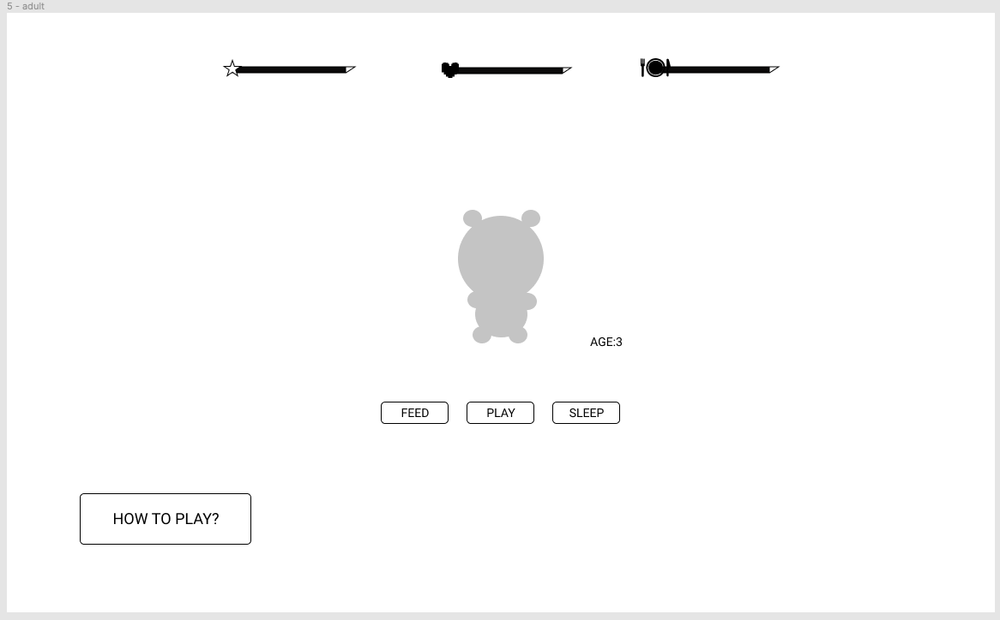
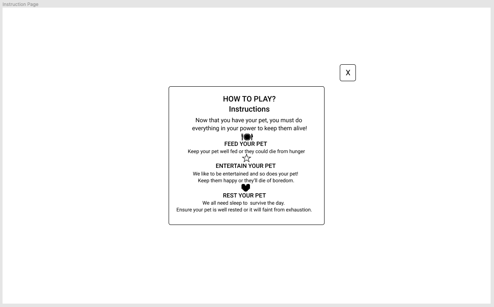
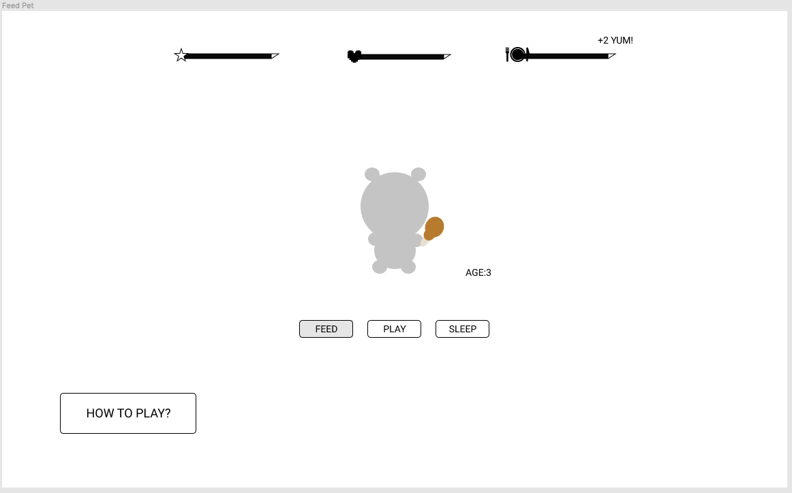
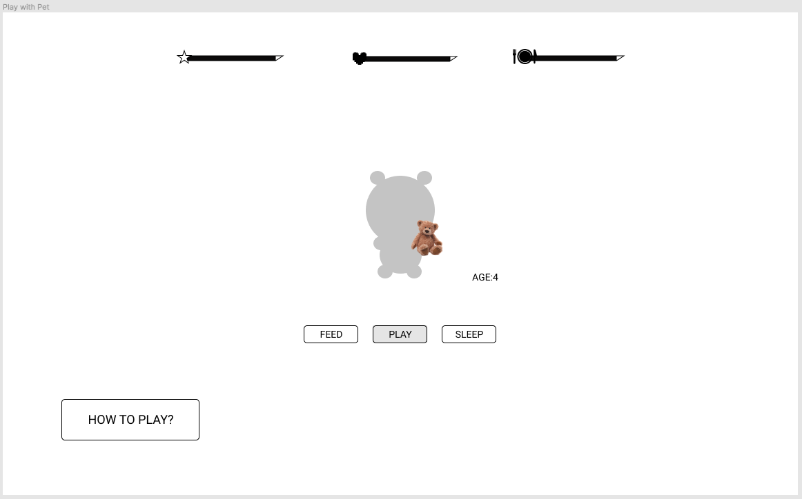

# virtual-pet
Are you a good parent? Test out your parental skills with this adorable virtual pet.

# User Story:
As a user, I want an easy to care for virtual pet.
I want to get straight into the game and
 not need to add any personal information or save
progress. The controls should be simple and concise.
While the game is simple,  it still 
relies on your survival skills. When in the event your
pet dies I would like the option to try again.

# Wireframes:

# HOW TO PLAY?

Instructions
Now that you have your pet, you must do everything in your power to keep them alive!
- FEED YOUR PET:
Keep your pet well fed or they could die from hunger
- ENTERTAIN YOUR PET:
We like to be entertained and so does your pet! 
Keep them happy or they’ll die of boredom.
- REST YOUR PET:
We all need sleep to  survive the day. 
Ensure your pet is well rested or it will faint from exhaustion.

# Day 1:

