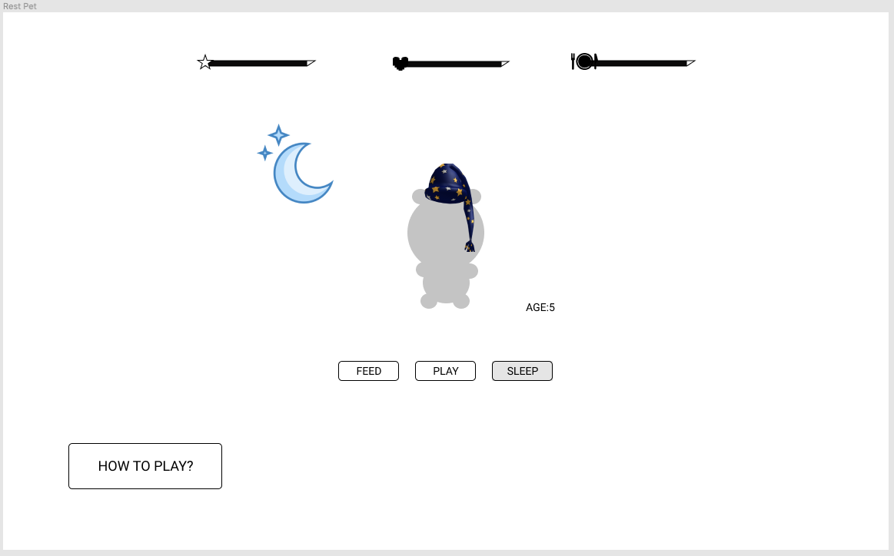

# virtual-pet
Are you a good parent? Test out your parental skills with this adorable virtual pet.

# User Story:
As a user, I want an easy to care for virtual pet.
I want to get straight into the game and
 not need to add any personal information or save
progress. The controls should be simple and concise.
While the game is simple,  it still 
relies on your survival skills. When in the event your
pet dies I would like the option to try again.

# Wireframes:

